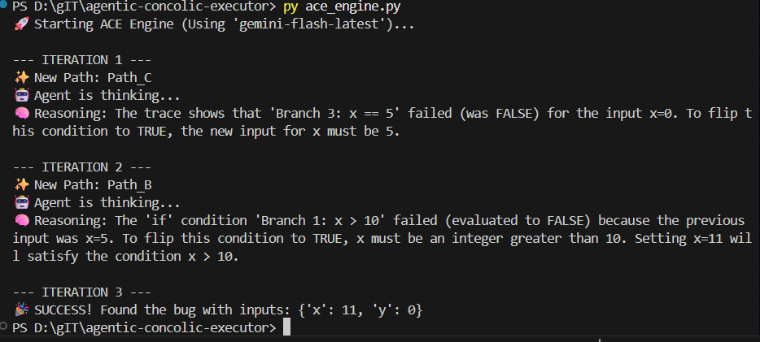
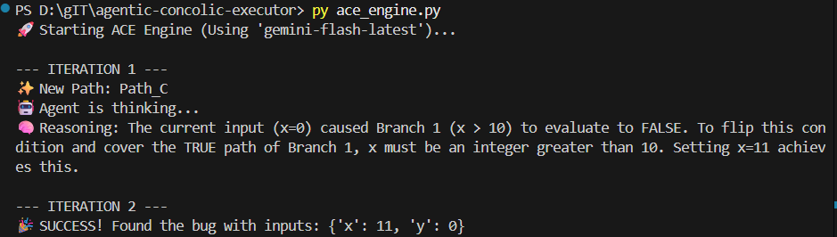

# Agentic Concolic Execution (ACE) Engine

> **An independent implementation of an LLM-guided software testing framework.**

## Project Overview
This project addresses the "Path Explosion Problem" in software testing. Instead of using brute-force mathematics (Symbolic Execution) to find bugs, this engine uses **AI Reasoning (Google Gemini)** to guide the testing process.

It demonstrates an **Agentic Workflow** where the system:
1.  **Reads** the execution trace of a program.
2.  **Analyzes** logical branches (True/False) using Semantic Inference.
3.  **Proposes** targeted inputs to explore new paths.

## Tech Stack
* **Language:** Python 3.12
* **AI Agent:** Google Gemini 1.5 Flash (via `google-genai` SDK)
* **Architecture:** Custom Orchestrator-Agent Pattern
* **Security:** Environment Variable Management (`python-dotenv`)
* **Tools:** VS Code, Git

## Project Structure
* `ace_engine.py`: The main engine containing the Target Program, Tracer, and AI Agent.
* `requirements.txt`: List of dependencies.
* `.env`: Secure storage for API keys (not uploaded to GitHub).

## How It Works
1.  **Target:** A Python function with hidden bugs and complex branching logic.
2.  **Tracer:** A custom class that records the "path" the code takes during execution.
3.  **Agent:** The LLM analyzes the trace and suggests new `(x, y)` inputs to satisfy logical constraints.
4.  **Loop:** The system iteratively hunts for bugs until the target is found.

## How to Run

### 1. Clone the repository
```bash
git clone https://github.com/chakreCh/agentic-concolic-executor.git
cd agentic-concolic-executor
```

### 2. Install dependencies
```bash
py -m pip install -r requirements.txt
```

### 3. Configure Security
Create a new file named `.env` in the root folder and add your API key:
```text
GOOGLE_API_KEY=your_actual_key_here
```

### 4. Run the Engine
```bash
py ace_engine.py
```

<br>

### 5. View Results
<details>
  <summary> <strong>Click to see the Agentic Concolic Executor results</strong></summary>
  <br>
  
  <p align="center">
    
     
  </p>
  
  <p align="center">
    <em>Left: First trial result. Right: Second trial result.</em>
  </p>
</details>

<br>


**Engineering Challenges Solved**
1. **API Rate Limiting:** Implemented an exponential backoff strategy to handle cloud API quotas without crashing the test loop.

2. **Fragility of Research Code:** Rebuilt the system from scratch to avoid the dependency conflicts and environment rigidity common in academic repositories.

3. **Secure Deployment:** Decoupled credentials from the codebase using environment variables to prevent API key leakage.
---
*Created by Chandan Akhil Reddy Challa*